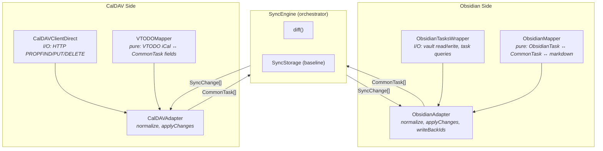

# CLAUDE.md

This file provides guidance to Claude Code (claude.ai/code) when working with code in this repository.

**Also read `AGENTS.md`** for standard Obsidian community plugin conventions (file structure, manifest rules, security, UX guidelines, coding conventions). This file covers project-specific instructions.

## Project Overview

This is an Obsidian community plugin that provides bidirectional sync between obsidian-tasks and CalDAV servers. Built with TypeScript, bundled with esbuild.

## Development Commands

- `npm run dev` - Start development with watch mode
- `npm run build` - Production build with type checking (`tsc -noEmit -skipLibCheck` then esbuild)
- `npm run lint` - Run ESLint with Obsidian plugin rules
- `npm test` - Run all tests (unit + E2E) with coverage. **Work is done when this passes.**
- `npm run test:unit` - Unit tests only, no Docker required
- `npm run test:watch` - Watch mode for unit tests only
- `npm run version` - Bump version numbers in manifest.json and versions.json

To run a single test file: `npx jest --selectProjects unit src/sync/diff.test.ts`  
To run tests matching a name pattern: `npx jest --selectProjects unit -t "pattern"`  
To run only Radicale/Vikunja/Nextcloud/Baikal E2E tests: `npm run test:e2e:radicale` / `:vikunja` / `:nextcloud` / `:baikal`

## Coding Standards

### TypeScript
- **No `any`** — use proper types, `unknown`, or type assertions with explanations
- **No floating promises** — always `await`, `void`, or `.catch()` promises
- **No unnecessary type assertions** — only cast when the type actually changes
- **Async functions must use `await`** — if a function doesn't await, don't mark it `async`

### UI Text
- **Sentence case everywhere** — headings, buttons, notices, command names
  - Correct: "Sync with CalDAV now", "View sync status"
  - Wrong: "Sync With CalDAV Now", "View Sync Status"
- See Obsidian style guide: https://help.obsidian.md/style-guide

### Clean code
- **Self-documenting** — if code needs a comment, rename the variable or extract a method instead
- **Push logic to the edges** — filtering, ID resolution, data shaping belong in adapters and I/O layers, not the orchestrator
- **One intent per line** — each line in an orchestrator method should express a single, clear action
- **No inline noise** — Notice calls, counting loops, string formatting go into private helpers
- **Methods as documentation** — `getOrSeedBaseline()` reads better than a 6-line if/else with a comment
- **No special-case accumulation** — if you find yourself adding "also include X when Y", question whether the abstraction is right

### Linting
- ESLint config: `eslint.config.mts` using `eslint-plugin-obsidianmd`
- All required Obsidian lint rules must pass before submission
- Test files (`*.test.ts`, `__mocks__/`) have relaxed `any` rules

## Code Architecture

### Build System
- **esbuild** bundler (config in `esbuild.config.mjs`)
- Entry point: `main.ts` → Output: `main.js`
- External: `obsidian`, `electron`, `@codemirror/*`, Node.js builtins

### Sync Architecture

Both sides follow a symmetric **Mapper → Adapter → I/O** pattern with `CommonTask` as the shared type:

**Layer responsibilities:**
- **Mapper** (pure, no I/O): Data transformation between native format and `CommonTask` fields. Stateless, fully unit-testable.
- **Adapter** (orchestrator): Calls mapper to normalize/denormalize, manages ID resolution, applies changesets using the I/O layer.
- **I/O** (Wrapper/Client): Raw read/write operations. `ObsidianTasksWrapper` talks to the Obsidian vault; `CalDAVClientDirect` talks to the CalDAV server via HTTP.

**Sync flow:** SyncEngine fetches both sides → adapters normalize to `CommonTask[]` → `diff()` produces `SyncChange[]` → adapters apply changes → new baseline saved.

### Plugin Structure
- `main.ts` — plugin lifecycle only (onload, onunload, commands)
- `src/sync/` — SyncEngine, diff, adapters (CalDAV + Obsidian), types (`CommonTask`, `SyncChange`)
- `src/caldav/` — CalDAVClientDirect (HTTP I/O), VTODOMapper (iCal parsing)
- `src/tasks/` — ObsidianTasksWrapper (vault I/O), ObsidianMapper (markdown parsing)
- `src/storage/` — sync state persistence (baseline, IdMapping for taskId↔caldavUid)
- `src/migrations/` — data migrations run once per vault on plugin load; `migrationRunner.ts` gates each migration by name in `settings.appliedMigrations`
- `src/ui/` — modals, settings tab
- `src/utils/` — task ID generation, helpers

### Calendar configuration modes

`CalendarMapping` supports two modes, controlled by which fields are set:

- **URL-pinned** (`calendarUrl` non-empty): talks directly to the CalDAV collection URL, skips discovery. Preferred for new calendars.
- **Legacy by-name** (`serverUrl` + `calendarName`, `calendarUrl` empty): discovers calendars under `serverUrl` and matches by name. Kept for backward compatibility.

Both modes share the same `obsidianTag`, `caldavCategory`, `username`, `password`, and `syncDirection` fields.

### Diff invariants

`diff()` in `src/sync/diff.ts` is a pure three-way merge (obsidian × caldav × baseline). Two subtle invariants:

- `startDate` (🛫) is **excluded from `tasksEqual()`** — it has no CalDAV counterpart and excluding it prevents every task with a start date from re-syncing forever.
- The `reconcile` change type is emitted when both sides have a task with no baseline entry and matching content — this stitches together tasks from an initial import without treating them as conflicts.

### Key Patterns
- Commands: `addCommand()` with `callback` or `editorCallback`
- Settings: `PluginSettingTab` with `loadData()`/`saveData()`
- Cleanup: `registerDomEvent()`, `registerInterval()` for auto-cleanup
- Modals: extend `Modal`, implement `onOpen()`/`onClose()`

## Testing

### Principles
- Test behavior, not implementation. Focus on what can break.
- Use TDD: write failing test first, then implement
- Coverage thresholds must be met

### Test Architecture
Single `jest.config.js` with two projects (`unit` and `e2e`). Coverage merged.

**Unit tests** (`src/**/*.test.ts`) — pure logic, fast, no Docker:
- VTODO parsing, task ID generation, sync diff engine, adapters, storage

**E2E tests** (`test/e2e/**/*.e2e.test.ts`) — real CalDAV server via Docker:
- CalDAV round-trips, server quirks, full sync pipeline
- Each test file gets isolated random calendar via `createIsolatedCalendar()`

### Coverage Thresholds
- `src/sync/` — 80% lines, 80% branches
- `src/caldav/` — 80% lines, 70% branches
- `src/tasks/` — 80% lines, 80% branches

Excluded: `requestDumper.ts`, `obsidianTasksApi.ts`, `src/ui/`

### E2E Design
- Use `FetchHttpClient` (not Obsidian's `requestUrl`)
- Test the round-trip: create → fetch → verify
- Local Radicale server via Docker (`docker-compose.yml`)
- All tests run with `TZ=America/New_York` (set in `jest.config.cjs` before workers spawn). Date assertions must account for this fixed timezone.

### Obsidian smoke tests (wdio)
Uses [wdio-obsidian-service](https://github.com/jesse-r-s-hines/wdio-obsidian-service) to launch a real Obsidian instance with the real obsidian-tasks plugin and our built plugin against a local Docker Radicale server.

**Scope:** four emoji happy-path scenarios (Obsidian→CalDAV create, CalDAV→Obsidian create, bidirectional update, completion+delete) plus one dataview full round-trip. The dataview spec uses a dedicated fixture vault (`test/wdio/vault-dataview/`) whose obsidian-tasks settings are preset to dataview (`obsidian-tasks-plugin/data.json` → `taskFormat: dataview`); our plugin has no task-format setting and automatically follows obsidian-tasks' configured format (via `ObsidianTasksWrapper.getConfiguredFormat()`), so the dataview spec needs no runtime override. These happy-path specs configure the plugin by **calendar URL** (`useCalendarUrl`), so they exercise the URL-pinned `connect()` path by default. A dedicated `calendarUrl.e2e.ts` covers the **legacy→URL upgrade** (a `useCalendar` name-based config, then `pinCalendarUrl`) and asserts exact VTODO counts to prove the baseline is preserved (no re-sync/duplicate); count-based specs reset `Tasks.md` in `beforeEach` because the vault is shared across `it` blocks. Edge cases and error paths stay in the Jest unit/E2E suites.

**Run:** `npm run test:wdio` (requires Docker for Radicale; first run downloads an Obsidian binary into `.obsidian-cache/`).

**CI:** separate `wdio.yml` workflow job, independent from the Jest `ci.yml` jobs.

**Coverage caveat:** runs in Electron, so it does NOT contribute to the Jest coverage thresholds. It provides fidelity/regression coverage — it catches `obsidian-tasks` API drift (e.g. changes to the internal `getTasks()` path) that Jest mocks cannot catch. `jest-environment-obsidian` was evaluated and deferred; wdio is the only layer that exercises the real obsidian-tasks Cache path.

**Maintenance:** `test/wdio/vault/.obsidian/plugins/tasks-caldav-sync/data.json` (emoji vault) must be kept in sync with the `CalDAVSettings` shape in `src/types.ts` whenever settings fields change. The dataview vault does not contain our plugin's `data.json`; since our plugin automatically follows obsidian-tasks' configured format, no format override is needed there.

## Release

Releases are built and signed in CI — never from a local machine. The
released `main.js` must be reproducible by Obsidian's verifier, so the
binary always comes from `.github/workflows/release.yml`.

`master` is branch-protected (PR required, signed commits, Copilot
review) with no bypass actors. The release flow works **with** those
rules — it never pushes to master.

Process — one command:
1. `npm run release <version>` on master — creates a `release/<version>`
   branch, bumps `manifest.json`/`package.json`/`versions.json`, runs
   preflight (lint/typecheck/unit), commits, pushes the branch, opens a
   PR, and enables auto-merge (squash). Requires the authenticated `gh`
   CLI. It pushes **nothing** to master and builds nothing locally.
2. The PR merges to master once required checks/review pass. GitHub
   signs the squash commit (satisfies `required_signatures`).
3. `release-tag.yml` (trigger: push to master touching `manifest.json`)
   reads the new version, and if no release exists for it, creates the
   GitHub release as a **pre-release**, then calls `release.yml`.
4. `release.yml` (reusable; also kept on `release: published` for manual
   UI releases) checks out the tag, verifies tag == `manifest.json`
   version, builds, generates a build-provenance attestation, uploads
   `main.js`/`manifest.json`/`styles.css`, then promotes the pre-release
   to the latest stable release.

Notes:
- `release-tag.yml` calls `release.yml` via `workflow_call`, not via the
  `release: published` event — a release created with `GITHUB_TOKEN`
  does not trigger further workflow runs.
- Merge the release PR with **squash** (auto-merge uses squash). A
  rebase merge would replay unsigned local commits onto master and fail
  `required_signatures`.
- Tag matches `manifest.json` version exactly (no `v` prefix).
- It ships as a pre-release until CI finishes, so there is never a
  public window with missing assets (Obsidian ignores pre-releases).
- Never upload a locally-built `main.js`.
